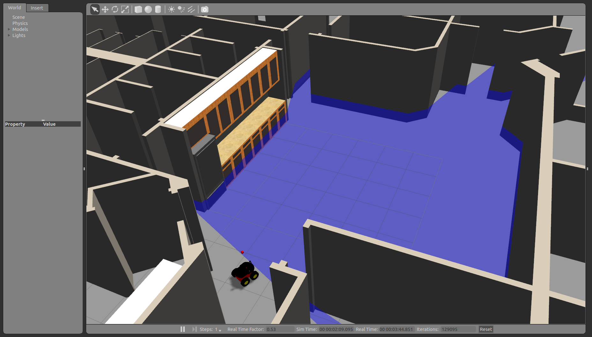

pioneer3at_ETSIDI: Pioneer 3 AT setup at ETSIDI-UPM
===================================================

This repo hosts ROS packages working on Indigo version. This packages are needed to setup a CATKIN workspace  and include all files needed for Pioneer 3 AT robot at ETSIDI-UPM university.

#### Navigation Video Demo

#### First navigation steps compilation

Submodules
----------------
Pioneer 3 AT uses the following additional ROS packages showed up as git submodules:

- [rosaria](https://github.com/amor-ros-pkg/rosaria): Interface with Aria library to control motors, battery and encoders. (See [rosaria docs](http://wiki.ros.org/ROSARIA))

- [p2os(indigo-stable)](https://github.com/allenh1/p2os/tree/indigo-stable): package with some useful configurations for navigation and pioneer urdf models. (See [p2os docs](http://wiki.ros.org/p2os)).

- [LMS1xx](https://github.com/clearpathrobotics/LMS1xx): Sick ROS drivers from ClearPath Robotics to use Sick LMS100 ethernet laser scanner. (See [LMS1xx docs](http://wiki.ros.org/LMS1xx)).

- [freenect_stack](https://github.com/ros-drivers/freenect_stack): For Kinect 1 XBOX 360, (See [freenect_stack docs](http://wiki.ros.org/freenect_stack) and [freenect_launch docs](http://wiki.ros.org/freenect_launch)).

- [depthimage_to_laserscan](https://github.com/ros-perception/depthimage_to_laserscan): Creates LaserScan data from depthimage devices such as kinect. (See [depthimage_to_laserscan docs](http://wiki.ros.org/depthimage_to_laserscan)).

- [turtlebot_apps](https://github.com/turtlebot/turtlebot_apps): Interactive implementations reused for P3AT robot such as "follower" demo. (See [turtlebot docs](http://wiki.ros.org/Robots/TurtleBot)).

Catkin workspace
----------------

Please, refer to de ROS Indigo installation page and follow the steps to install and set your ROS environment as well as updating rosdep tool.

- [ROS Indigo installation wiki](http://wiki.ros.org/indigo/Installation/Ubuntu).

Steps may change for each ROS version:

1.- ``$ sudo apt-get install ros-indigo-desktop-full``

2.- ``$ sudo rosdep init``

3.- ``$ rosdep update``

All theese files and directories should be placed at src/ directory in a [catkin workspace](http://wiki.ros.org/catkin).
Follow steps in a terminal:

  1.- ``$ catkin_init_workspace catkin_ws``
  
  2.- ``$ cd catkin_ws/src``
  
  3.- ``$ git clone --recursive https://github.com/danimtb/pioneer3at_ETSIDI.git .``	(NOTE THE . AT THE END OF THE LINE)

  4.- ``$ cd ~/catkin_ws``

  5.- ``$ rosdep install rosaria``

  6.- ``$ rosdep install freenect_launch``

  7.- ``$ catkin_make`` This will compile all targets placed in you catkin src directory

You'll may also need ros navigation stack and gmapping:

``$ sudo apt-get install ros-indigo-navigation``

``$ sudo apt-get install ros-indigo-gmapping``

For turtlebot applications to compile and run:

``$ rosdep install turtlebot``

``$ rosdep install turtlebot_teleop``

Content: pioneer_utils
----------------------
This is the core of my work. **pioneer_utils** mainly adds some configuration specific parameters to keep all things working.

- Odometry params calibrations used in rosaria.

- Laser IP address.

- Pioneer URDF model with Sick Laser and Kinect.

- Navigation tweaks in costmaps, base and planners.

- depthimage to scan configs (for low, medium and long range obstacles).

- Gazebo settings and launch files with gazebo plugins and urdf model.

- Maps used at ETSIDI-UPM Lab and in gazebo Willow Garage world.

- RViz launch files with specific visualization configs.

And implements easy to use nodes:

- Teleoperation node.

		$ rosrun pioneer_utils teleop_p3at

- Dead Reckoning node: Let robot move alone and making turns.

		$ rosrun pioneer_utils moving_alone

- nav-waypoints node (navigation_goals): Send global or local goals to navigation stack.

		$ rosrun pioneer_utils nav-waypoints

- endurance_test node: implements randomly navigation to a list of points

	See launch file template:
		
		$ roslaunch pioneer_utils endurance_test.launch

	List of points as *map_locations.txt* rosparam.
    
Usage
-----

This repository is intended to be a simple method to setup and run everything needed to use Pioneer 3 AT.

After clonning this github repo in your catkin_ws src/ directory do the following:

``$ cd catkin_ws``

``$ catkin_make``

#### Navigation Stack

Now run "roscore" and the nodes needed with the .launch file you'll find in src/ directory.

In your terminal run "roscore":

  ``$ roscore``

In other terminal, we'll bring up all drivers for hardware using kinect, laser Sick, and Rosaria with calibration config setup:

  ``$ roslaunch pioneer_utils pioneer3at-rosaria.launch``

Now, you can start navigation stack with amcl like this:

  ``$ roslaunch pioneer_utils navigation_pioneer-3at.launch``

#### Pioneer 3 AT Follower (from turtlebot)

Open a terminal and launch the follower:

``$ roslaunch pioneer_utils simple_follower.launch``

If you want to guide your robot following you to build a map, run instead:

``$ roslaunch pioneer_utils gmapping-follower.launch``

#### Pioneer 3 AT Panorama (from turtlebot)

Open a terminal and launch the panorama:

``$ roslaunch pioneer_utils panorama-pioneer-3at.launch``

Follow [turtlebot's panorama wiki](http://wiki.ros.org/turtlebot_panorama/Tutorials/Demo) to know how to use this and take nice panorama pics. Also see [turtlebot_panorama API](http://wiki.ros.org/turtlebot_panorama).

Gazebo Simulation
-----------------

Open a terminal and launch the follower:

``$ roslaunch pioneer_utils pioneer3at_gazebo_world.launch``

If you want to do some navigation with Willow Garage's map type in other terminal:

``$ roslaunch pioneer_utils pioneer3at_gazebo_world.launch``

